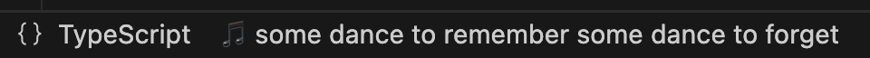
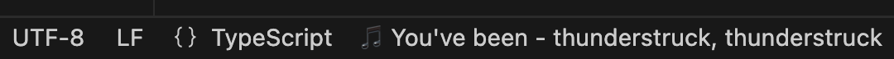

# Now Playing Lyrics

Display synchronized lyrics for your currently playing songs directly in VSCode! Supports both Apple Music and Spotify.

## Screenshots

### Status Bar Views

## ⚠️ Requirements

- **macOS only**: This extension uses AppleScript to interact with Music and Spotify apps
- Apple Music or Spotify desktop app
- VSCode 1.85.0 or higher

## Features

- 🎵 Shows synchronized lyrics in the status bar
- 🎶 Supports both Apple Music and Spotify
- 📝 Click to view full lyrics in a side panel
- 🔄 Auto-updates as the song plays
- 🎯 Command palette support: "Show Now Playing Lyrics"

## Installation

### VSCode (Recommended)
1. Install the extension from the [VSCode Marketplace](https://marketplace.visualstudio.com/items?itemName=maniyadv.now-playing-lyrics)
2. The lyrics will automatically appear in the status bar when you play music

### Cursor and Windsurf
1. Download the `.vsix` file from [GitHub Releases](https://github.com/maniyadv/vscode-now-playing-lyrics/releases/latest)
2. Open Cursor/Windsurf
3. Go to Extensions (Cmd+Shift+X)
4. Click on the "..." menu (top-right)
5. Select "Install from VSIX..."
6. Choose the downloaded `.vsix` file

Note: The VSIX file on GitHub is identical to the version on VSCode Marketplace.

## Usage

1. Play a song in Apple Music or Spotify
2. The current lyrics will appear in your status bar
3. Click on the lyrics or use the command "Show Now Playing Lyrics" to open the full view
4. The lyrics will automatically update as the song plays

## Known Limitations

- Only works on macOS due to AppleScript dependency
- Requires Apple Music or Spotify desktop app to be installed
- Some songs might not have synchronized lyrics available

## Privacy & Security

This extension:
- Only accesses currently playing song information (title and artist)
- Does not store any personal data or listening history
- Makes API requests only to fetch lyrics
- All API requests are made over HTTPS

## License

MIT License - see the [LICENSE](LICENSE) file for details

## Contributing

Found a bug or want to contribute? Feel free to open an issue or submit a pull request on [GitHub](https://github.com/maniyadv/vscode-now-playing-lyrics).
